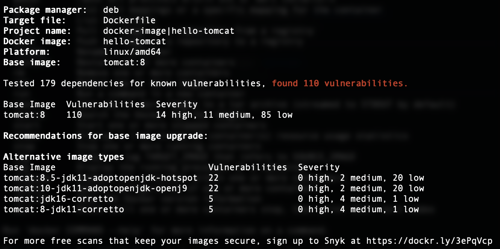

# Introduction

Container security has many components relating to the images, repository, the runtime, orchestration and even the Host-OS.

In this lab we will focus on the security of the container images themselves here, and one important focus here is to scan the images for security vulnurabilities and keep them up to date.

# Build and scan a basic container application

Docker Desktop comes with a tool to scan container images for Common Vulnurabilits and Exposures (CVE) out of the box. This tool hinges on the the Snyk toolchain which means can also be used without Docker Desktop.

When working with containers most of your images will be created on top of a base image from a registry. In this tutorial, we will build an image using a base image from the docker registry and then scan it for CVEs.

We'll start by building the image as defined in the Dockerfile included in this Lab. In the command line, navigate to the Lab repository and run the command below:

` docker build -t hello-tomcat .`

**This will require Docker Desktop**. After a couple of minutes this should have finished to build the image.

Next we'll do a detailed scan of our image to check CVEs using the built-in tool with the next command

` docker scan --file=Dockerfile hello-tomcat `

This will report a large number of CVE and trace them back to the base image that we used in the Dockerfile:

In order to remove these CVE we can change to a version of the base image with much less vulnurabilities. In this case, change the Dockerfile to refer to the `tomcat:8-jdk11-corretto` image file

Afterwards, save the Dockerfile and build the image again. Run the scan once again and report the total number of found vulnerabilities. It should be much smaller than after the first scan.

---
Note: the same scans could be performed without Docker using Snyk's toolchain. For information on how to install and use those tools see e.g. [Lynk CLI docs](https://support.snyk.io/hc/en-us/articles/360003812538-Install-the-Snyk-CLI)
